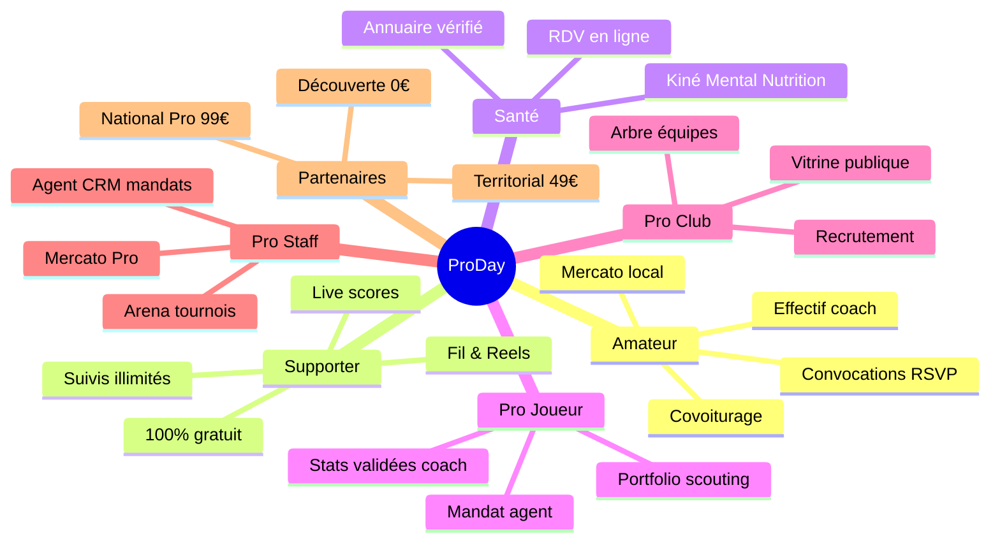
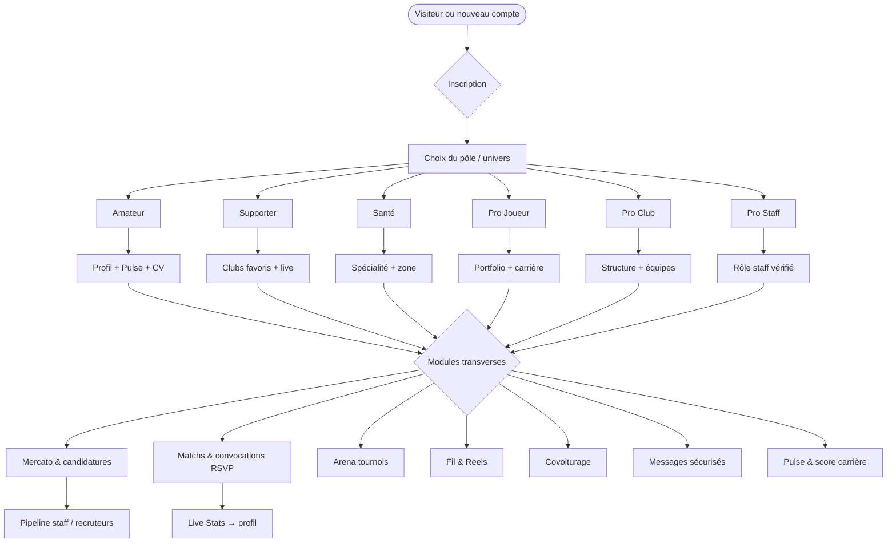
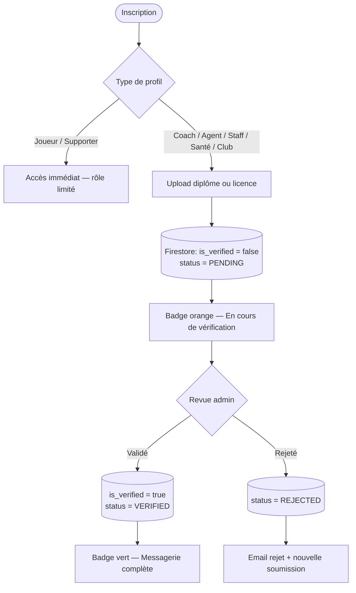
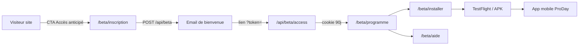
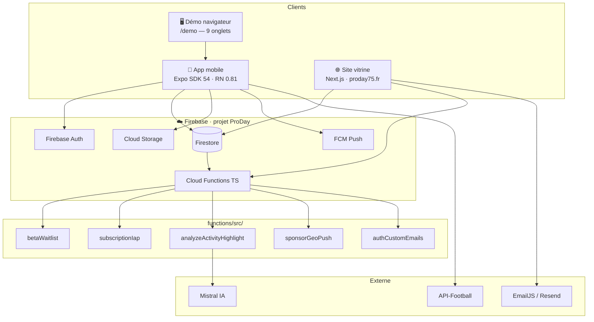

<div align="center">


<br /><br />

**CONNECTER • PROGRESSER • RÉUSSIR**

<br />

*Profil, Mercato, journal d'activités et saison — une app mobile honnête sur ce qui est livré aujourd'hui.*

<br />

[](https://proday75.fr)
[](https://proday75.fr/beta/inscription)

<br />

**© ProDay 2026 — Tous droits réservés** · Code propriétaire — reproduction interdite sans autorisation

</div>

---

> **Documentation publique ProDay** — le code source de l'application est **privé**.  
> Site : [proday75.fr](https://proday75.fr) · Contact : [contact@proday.app](mailto:contact@proday.app) · Partenariats / accès code : [contact@proday.app](mailto:contact@proday.app)


---

## Sommaire

1. [ProDay en bref](#proday-en-bref)
2. [Vision & mission](#vision--mission)
3. [Les six univers ProDay](#les-six-univers-proday)
4. [Parcours utilisateur](#parcours-utilisateur)
5. [Fonctionnalités clés](#fonctionnalités-clés)
6. [Sécurité & validation](#sécurité--validation)
7. [Programme bêta fermée](#programme-bêta-fermée)
8. [État actuel & roadmap](#état-actuel--roadmap)
9. [Architecture technique](#architecture-technique)
10. [Stack détaillée](#stack-détaillée)
11. [Structure du monorepo](#structure-du-monorepo)
12. [Accès au code source](#accès-au-code-source)
13. [Scripts & commandes](#scripts--commandes)
14. [Documentation](#documentation)
15. [FAQ rapide](#faq-rapide)
16. [Contact](#contact)

---

## ProDay en bref

ProDay relie **carrière, club et communauté** dans le foot amateur et semi-pro. Une seule application mobile couvre convocations, recrutement (Mercato), matchs, tournois Arena, visibilité joueur (Pulse), communauté (Fil & Reels) et espace partenaires — avec un site vitrine sur [proday75.fr](https://proday75.fr) qui décrit le produit avec la même honnêteté.

> Les chiffres affichés sur le site (9+ onglets, 12 modules…) décrivent **l'architecture produit**, pas une audience en temps réel. L'analyse IA porte sur vos **highlights de séance** (vidéo ou poster + notes), pas sur chaque geste en match.

**Pour qui ?** Joueurs et joueuses, coachs amateur, supporters, praticiens santé, joueurs pro, clubs, staff (agent · recruteur · coach · organisateur) et sponsors — chacun avec un **pôle** et une coque adaptés.

Pages détaillées : [Fonctionnalités](https://proday75.fr/fonctionnalites) · [Vision](https://proday75.fr/vision) · [Roadmap](https://proday75.fr/roadmap) · [Partenaires](https://proday75.fr/partenaires)

---

## Vision & mission

**Mission** — *Connecter • Progresser • Réussir* : donner à chaque acteur du foot amateur les outils du haut niveau, **sans surestimer l'IA**.

ProDay naît d'un constat simple : une équipe U17 jongle entre cinq groupes WhatsApp, un tableur Excel pour les convocations et des annonces Mercato éparpillées sur les réseaux. ProDay **unifie** ces flux dans une app mobile React Native / Expo, avec des données **réelles** depuis Firestore (pas de mock en production).

| Pilier | Ce que ça signifie concrètement |
|--------|----------------------------------|
| **Plateforme unifiée** | Carrière, club, convocations, matchs et tournois — tout au même endroit |
| **Confiance ProDay** | Diplômes staff validés avant messagerie complète ; contrôle parental pour les mineurs |
| **CV vivant** | Chaque match nourrit le profil ; export PDF professionnel en un geste |
| **IA honnête** | Analyse Mistral sur les séances enregistrées dans le journal — pas une promesse frame-by-frame sur tout le terrain |
| **Demain** | Repérage talent mondial, paiements tournois, push géo agents — voir [roadmap](#état-actuel--roadmap) |

**Aujourd'hui vs demain** — Le produit distingue clairement ce qui est livré de ce qui est ambition :

- **Aujourd'hui** : profil & Pulse, score carrière, journal d'activités, analyse IA highlights, Mercato, matchs & Live Stats, Arena, Fil & Reels, sponsors, pôle santé, covoiturage, contrôle parental, admin.
- **Demain** (non promis) : analyse vidéo frame-by-frame avancée, détection automatique des talents, notifications géo agents à grande échelle, paiements tournois intégrés, couverture IAP complète.

---

## Les six univers ProDay

Comme sur [proday75.fr](https://proday75.fr), la navigation s'articule autour de **six pôles** dans le carousel principal. Le **pôle Partenaires** (sponsors & marques) est accessible depuis [proday75.fr/partenaires](https://proday75.fr/partenaires), hors carousel.

### Tableau des pôles

| Pôle | Public | Tagline | En détail |
|------|--------|---------|-----------|
| **Amateur** | Joueurs & coachs | *JOUER • ENCADRER • PARTAGER* | Ton club, ta semaine, tes déplacements — convocations, covoiturage et effectif. Genre H/F choisi à l'inscription. Mercato local, district & régional. Distinct du pôle Pro (staff professionnel). |
| **Supporter** | Fans & communauté | *SUIVRE • VIBRER • PARTAGER* | Tribune **100 % gratuite** — matchs live (PRODAY + monde via API-Football), suivis illimités, débats, Reels et shop merch. Sans Mercato ni abonnement store. |
| **Santé** | Praticiens & staff médical | *SOIGNER • ACCOMPAGNER • PERFORMER* | Kinés, coach mental, nutritionnistes — annuaire vérifié, prise de RDV près des clubs. Messagerie complète après validation des diplômes. |
| **Pro Joueur** | Joueurs pro | *CARRIÈRE • VISIBILITÉ • OPPORTUNITÉS* | Carrière, portfolio scouting, essais et mandat agent. Stats badge « Validé coach ». Distinct du foot amateur district. |
| **Pro Club** | Structures & équipes | *STRUCTURE • ÉQUIPES • RECRUTEMENT* | Président, DS, secrétariat — arbre des catégories (U13, U17, Seniors F…), adhésions, annonces recrutement et vitrine club publique. |
| **Pro Staff** | Agent · Recruteur · Coach · Orga | *MÉTIERS • MANDATS • SCOUTING* | Mercato Pro, shortlists scouting, convocations groupe, tournois Arena. Chaque métier a sa coque et ses quotas d'abonnement. |
| **Partenaires** *(hors carousel)* | Sponsors & marques | Visibilité mesurée | Découverte (0 €), Territorial (49 €/mois), National Pro (99 €/mois) — ROI campagnes, visibilité clubs, push géo local (bêta). |

### Écosystème des pôles



> **Man & Woman** — Les univers *Pro Day Man* et *ProDay Woman* (foot masculin / féminin amateur) partagent le pôle Amateur pour les coachs, avec des coques Mercato M / Mercato F dédiées aux joueurs. Voir [proday75.fr/homme](https://proday75.fr/homme) et [proday75.fr/woman](https://proday75.fr/woman).

---

## Parcours utilisateur

Après inscription, l'utilisateur choisit son **pôle** puis accède aux **modules** visibles selon son rôle. L'app expose jusqu'à **9 onglets dynamiques** (Accueil, Candidater/Mercato, Matchs, Reels, Fil, Covoit., Santé, Messages, Profil) — certains masqués selon l'univers.



<details>
<summary>Parcours détaillé par rôle (coach, recruteur, agent, club, parent, partenaire…)</summary>

| Rôle | Étapes clés |
|------|-------------|
| **Coach** | Vérification diplôme → effectif → annonces → convocations & Live Stats |
| **Recruteur** | Profil vérifié → territoire → Mercato Pro → pipeline candidatures |
| **Agent** | Profil vérifié → repérage & mandats → contacts → pipeline mandats |
| **Club** | Profil & équipes → annonces Mercato → candidatures → convocations |
| **Parent** | Supervision → contacts approuvés → limite de temps → rapport |
| **Partenaire** | Profil sponsor → offres & campagnes → visibilité Sponsors → stats |

</details>

Démo navigateur sans installer l'app : [proday75.fr/demo](https://proday75.fr/demo) — sélecteur Homme / Woman / Pro, 9 onglets comme sur mobile.

---

## Fonctionnalités clés

Chaque module est documenté sur [proday75.fr/fonctionnalites](https://proday75.fr/fonctionnalites). Voici l'essentiel :

### Profil, Pulse & carrière

- **Pulse ProDay** — Score de visibilité combinant profil, activité et confiance ; signature exclusive de la plateforme.
- **CV en ligne** — Stats saison, galerie, timeline de progression ; export PDF depuis l'onglet Profil.
- **Journal d'activités** — Séances, matchs, highlights enregistrés ; analyse IA Mistral sur miniature vidéo ou poster + tags.

### Mercato (recrutement intelligent)

- Annonces ciblées par poste, niveau et ville.
- Candidature depuis l'app, suivi des réponses.
- **Mercato M / F / Amateur / Pro** — filtres et permissions selon l'univers.
- Pipeline staff pour recruteurs, coachs, agents et clubs.

### Matchs, convocations & Arena

- **Matchs amicaux & détections** — calendrier unifié, RSVP (présent / absent / peut-être), relances.
- **Live Stats** — Buts, passes, cartons en direct ; alimentation automatique du profil et du CV.
- **Arena** — Création tournoi, inscriptions club, tableaux, scores et palmarès publiés.

### Communauté & visibilité

- **Fil** — Publications clubs et joueurs, réactions, question hebdo.
- **Reels** — Vidéos courtes verticales pour moments forts et visibilité profil.
- **Dashboard IA d'accueil** — Recommandations matchs, progression, alertes.

### Transversal

- **Covoiturage** — Trajets match & détection intégrés aux événements (style BlaBlaCar).
- **Pôle santé** — Annuaire praticiens vérifiés ; contact sécurisé joueur ↔ pro.
- **Espace partenaires** — Découverte (0 €), Territorial (49 €), National Pro (99 €/mois) ; impressions et conversions suivies.
- **Famille & mineurs** — Contrôle parental, portail tuteur, espace jeunes.
- **ProDay Shop** — Trépieds, textile et maillots par univers ; précommande en attendant IAP complet.

---

## Sécurité & validation

ProDay applique une politique de **confiance graduée** : les joueurs et supporters accèdent rapidement ; les rôles à responsabilité (coach, agent, recruteur, praticien santé, club, sponsor) passent par une **revue admin** avant déblocage complet.



| Étape | Détail |
|-------|--------|
| 1. Document reçu | Photo ou scan du diplôme / carte pro |
| 2. Authenticité | Contrôle manuel ou semi-automatisé |
| 3. Établissement | Vérification de l'organisme émetteur |
| 4. Badge vérifié | Messagerie complète, annonces Mercato actives selon le plan |

**Firestore rules** — `firebase/firestore.rules` impose l'authentification, la propriété des documents et des champs sensibles (ex. `is_verified`, `subscription_tier`) modifiables uniquement par admin ou Cloud Functions.

**Mineurs** — Espace jeunes avec supervision parentale : contacts approuvés, limites de temps, rapport d'activité. Voir [proday75.fr/confiance](https://proday75.fr/confiance).

---

## Programme bêta fermée

ProDay est en **bêta fermée** : l'app n'est pas encore sur les stores publics. Les testeurs s'inscrivent sur la liste d'attente et reçoivent un accès prioritaire (TestFlight iOS / APK Android).

> Inscrivez-vous sur la [liste d'attente](https://proday75.fr/beta/inscription) pour suivre l'avancement du produit et accéder en priorité au lancement.

### Parcours waitlist → app



| URL | Accès | Rôle |
|-----|-------|------|
| [proday75.fr/beta/inscription](https://proday75.fr/beta/inscription) | Public | Inscription waitlist |
| [proday75.fr/beta/programme](https://proday75.fr/beta/programme) | Cookie bêta | Programme — six pôles, modules |
| [proday75.fr/beta/installer](https://proday75.fr/beta/installer) | Cookie bêta | Guides APK / TestFlight |
| [proday75.fr/beta/aide](https://proday75.fr/beta/aide) | Cookie bêta | FAQ et support bêta |

**Règle nav site** — Tous les CTA « Accès anticipé » pointent vers `/beta/inscription` uniquement, jamais vers `/beta` directement.

### Checklist opérateur

```bash
npm run beta:check   # Firebase, typecheck, Jest, règles Firestore, pages légales
```

Guides complets : [docs/BETA_LAUNCH.md](docs/BETA_LAUNCH.md) · [docs/BETA_GUIDE.md](docs/BETA_GUIDE.md) · [docs/BETA_WAITLIST.md](docs/BETA_WAITLIST.md)

---

## État actuel & roadmap

Statut honnête au moment de la bêta — aligné sur [docs/BETA_LAUNCH.md](docs/BETA_LAUNCH.md) et la [roadmap site](https://proday75.fr/roadmap).

| Phase | Statut | Exemples |
|-------|--------|----------|
| **Livré** | ✅ | Dashboard IA, profil & Pulse, score carrière, journal, analyse IA highlights, Mercato, matchs & Live Stats, covoiturage, pôle santé, Arena, Fil & Reels, sponsors, contrôle parental, admin & vérif. staff |
| **En cours** | 🔄 | Cloud Functions Blaze & Storage, site vitrine aligné produit, IAP store (16 SKU), push géo partenaires (bêta) |
| **À venir** | 📋 | Analyse vidéo frame-by-frame, détection talent mondiale, notifications géo agents, paiements tournois |

**Accès Pro en bêta** — Sans IAP actif, les testeurs Pro sont activés manuellement dans Firestore (`subscription_tier = "pro"`). Voir [docs/PRICING_STRATEGY.md](docs/PRICING_STRATEGY.md).

**Builds mobile** — Profil EAS `preview` avec `EXPO_PUBLIC_V3_SHELL=1` (UI V3). Package : `com.proday.app`.

---

## Architecture technique

Le monorepo regroupe **app mobile Expo**, **site Next.js** et **backend Firebase** — une seule source de vérité Firestore pour les données utilisateur.



**Principes**

- Données **réelles** depuis Firestore — pas de mock en production.
- Règles de sécurité dans `firebase/firestore.rules` et `firebase/storage.rules`.
- Site déployé depuis `website/` (Netlify). App distribuée via EAS Build.
- Diagrammes exportables : `assets/diagrams/`. Schémas exportables décrits dans ce README ; détails d'implémentation dans le dépôt privé.

---

## Stack détaillée

| Couche | Technologie | Rôle dans ProDay |
|--------|-------------|------------------|
| **Mobile** | Expo SDK 54 · React Native 0.81 · TypeScript | App iOS / Android / Web — 9 onglets, shells par univers (Homme, Woman, Pro, Sponsor, Admin) |
| **Site vitrine** | Next.js App Router (`website/`) | Marketing, tarifs, bêta waitlist, démo navigateur, pages légales — 21+ routes publiques |
| **Auth** | Firebase Auth | Email, Apple Sign-In ; sessions sécurisées app + site |
| **Base de données** | Cloud Firestore | Profils, Mercato, matchs, convocations, waitlist bêta, abonnements |
| **Fichiers** | Firebase Storage | Diplômes, highlights vidéo, assets profil |
| **Push** | FCM via Cloud Functions | Relances convocations, alertes Mercato, push géo sponsors (bêta) |
| **Serveur** | Cloud Functions TypeScript | IAP validation, analyse IA, sync activités, emails Auth brandés, waitlist |
| **IA** | Mistral (via CF) | Analyse des highlights de séance enregistrés dans le journal |
| **Paiements** | expo-iap · 16 SKU | Abonnements Joueur Plus, Coach Pro, Agent Elite, etc. — déploiement progressif |
| **Builds store** | EAS Build · `com.proday.app` | TestFlight (preview) et production |
| **Tests** | Jest · Maestro | Unitaires + E2E mobile (`.maestro/`) |
| **CI** | GitHub Actions | Checks, déploiement site |

Configuration et schéma de données : documentation interne (dépôt privé).

---

## Structure du monorepo

```
PRODAY/                          Monorepo ProDay (app + site + backend)
├── src/                         App mobile Expo → src/README.md
│   ├── screens/                 Écrans (1 fichier ≈ 1 route)
│   ├── components/              UI par domaine (mercato, matchs, profile…)
│   ├── features/                Modules V3 (home IA, engines)
│   ├── services/                Accès Firebase et APIs externes
│   ├── navigation/              Onglets, shells joueur / sponsor / admin
│   └── theme/                   Tokens Homme / Woman / Pro
├── website/                     Site vitrine Next.js → website/README.md
│   ├── src/app/                 Routes App Router (beta, univers, tarifs…)
│   ├── src/lib/                 content.ts, poles.ts, API bêta
│   └── public/branding/         Logos officiels (source de vérité visuelle)
├── functions/                   Cloud Functions → functions/README.md
├── firebase/                    Règles Firestore / Storage → firebase/README.md
├── docs/                        Documentation → docs/README.md
├── scripts/                     Outils CLI → scripts/README.md
├── assets/                      Branding, diagrammes Mermaid → assets/README.md
├── .maestro/                    Flows E2E mobile → .maestro/README.md
└── e2e/                         Guide tests → e2e/README.md
```

| Dossier | Contenu principal | Quand le consulter |
|---------|-------------------|--------------------|
| `src/` | Toute l'app mobile | Feature mobile, navigation, écrans |
| `website/src/lib/content.ts` | Copy produit site (source marketing) | Textes pôles, tarifs, FAQ |
| `website/src/lib/poles.ts` | Définition des 6 pôles carousel | Navigation site, pricing par pôle |
| `functions/src/` | Logique serveur (IAP, IA, bêta, push) | Backend, webhooks, triggers |
| `firebase/` | Règles sécurité + index Firestore | Permissions, déploiement rules |
| `docs/` | Guides opérateur, architecture, juridique | Bêta, stores, admin |

Structure et pôles : décrits dans ce README et sur [proday75.fr](https://proday75.fr).

---

## Accès au code source

Le dépôt applicatif **PRODAY** (monorepo mobile, site, Cloud Functions) est **privé** et n'est pas clonable publiquement.

| Besoin | Action |
|--------|--------|
| **Tester ProDay** | Inscription bêta sur [proday75.fr/beta/inscription](https://proday75.fr/beta/inscription) |
| **Partenariat technique ou accès repo** | [contact@proday.app](mailto:contact@proday.app) |
| **Signaler une vulnérabilité** | Voir [SECURITY.md](./SECURITY.md) |

Les sections ci-dessus décrivent l'**architecture produit** et la stack à titre informatif, sans instructions d'installation du code privé.

## Scripts & commandes (aperçu)

L'application est un monorepo npm (Expo, Next.js, Cloud Functions). Les commandes de développement (`npm start`, `npm run website:dev`, déploiement Firebase/EAS, etc.) sont réservées aux contributeurs autorisés sur le dépôt privé.

## Documentation

La documentation technique détaillée (architecture, schéma Firestore, guides bêta, design system) est maintenue dans le **dépôt privé** PRODAY. Ce dépôt public regroupe la présentation produit et les informations légales.

| Ressource publique | Lien |
|--------------------|------|
| Site vitrine | [proday75.fr](https://proday75.fr) |
| Fonctionnalités | [proday75.fr/fonctionnalites](https://proday75.fr/fonctionnalites) |
| Roadmap | [proday75.fr/roadmap](https://proday75.fr/roadmap) |
| Partenaires | [proday75.fr/partenaires](https://proday75.fr/partenaires) |
| Politique de sécurité | [SECURITY.md](./SECURITY.md) |
| Licence | [LICENSE](./LICENSE) |

## FAQ rapide

**ProDay remplace-t-il WhatsApp pour mon équipe ?**
ProDay unifie convocations, matchs, Mercato et stats — fini les groupes éparpillés. La messagerie sert aux échanges directs entre profils inscrits.

**L'app est-elle gratuite ?**
Oui — un compte gratuit couvre profil, Pulse, calendrier, Arena en consultation et limites Mercato. Les offres Pro débloquent candidatures illimitées, multi-équipes, etc.

**Comment fonctionne la vérification coach ?**
Diplôme ou licence obligatoire à l'inscription. Badge orange pendant la revue, badge vert après validation admin — messagerie complète débloquée.

**Qu'est-ce que le Pulse ProDay ?**
Score de visibilité combinant profil, stats saison, candidatures et confiance. Plus il monte, plus vous êtes visible des clubs.

**ProDay analyse-t-il chaque action en vidéo ?**
Non. L'analyse IA porte sur les highlights enregistrés dans le journal (miniature vidéo ou image + notes). L'analyse frame-by-frame automatique est une ambition future.

**Comment contribuer ou tester en bêta ?**
Inscrivez-vous sur [proday75.fr/beta/inscription](https://proday75.fr/beta/inscription). Pour un accès au code source ou une contribution technique, contactez [contact@proday.app](mailto:contact@proday.app).

---

## Contact

[proday75.fr](https://proday75.fr) · [contact@proday.app](mailto:contact@proday.app) · [partenaires@proday.app](mailto:partenaires@proday.app) · [Documentation publique (PRODAY-docs)](https://github.com/alfredgibeau-ahoussinou/PRODAY-docs) · Code applicatif privé (sur demande)

**ProDay © 2026** — Tous droits réservés · Code propriétaire — reproduction interdite sans autorisation · [LICENSE](./LICENSE) · [SECURITY.md](./SECURITY.md)
